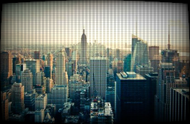

# Shader results

Here the samples results with applied shader effects.

| Shader name | Image |
| ------------- | ----- |
| CRT |  |
| GAUSSIAN_BLUR |  |
| BLOOM |  |
| GRAYSCALE |  |
| BOX_BLUR |  |
| CONVOLUTION |  |
| SHARPEN |  |
| EMBOSS |  |
| EDGE |  |
| LAPLACE |  |
| NOISE_REMOVER |  |
| RGBA |  |
| CARTOON |  |
| EMBOSS_WHITE |  |
| BUMP |  |
| MOTION_BLUR |  |
| RADIAL_BLUR |  |
| VIGNETTE |  |
| SEPIA |  |
| INVERSION |  |
| FISH_EYE |  |
| BARREL |  |
| ANTI_FISH_EYE | Erreur | 
| OUTLINES_WHITE |  |
| COMIC |  |
| SIMPLE_CARTOON |  |
| MONOCHROME_PALETTE |  |
| CGA_PALETTE |  |
| EGA_PALETTE |  |
| VGA_PALETTE |  |
